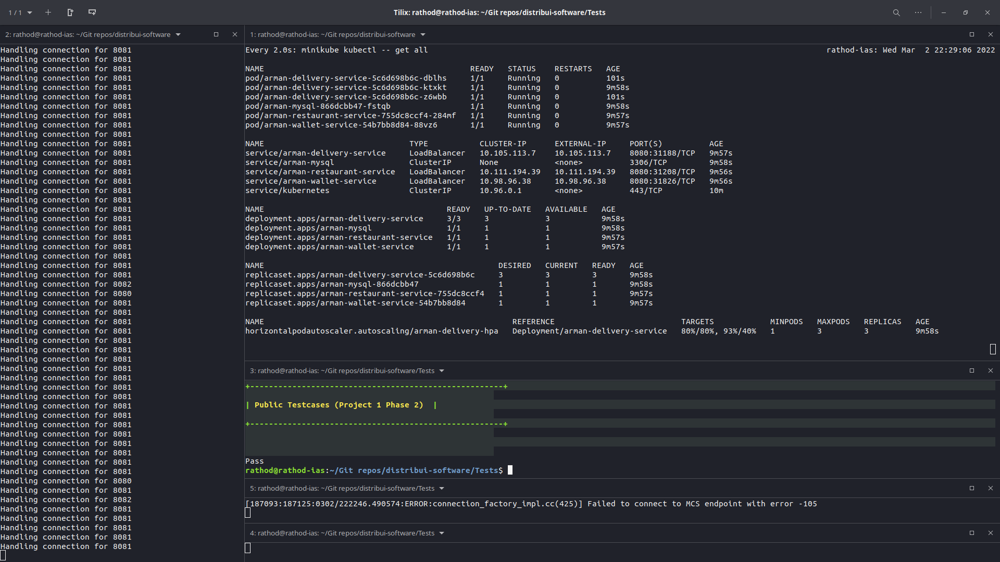
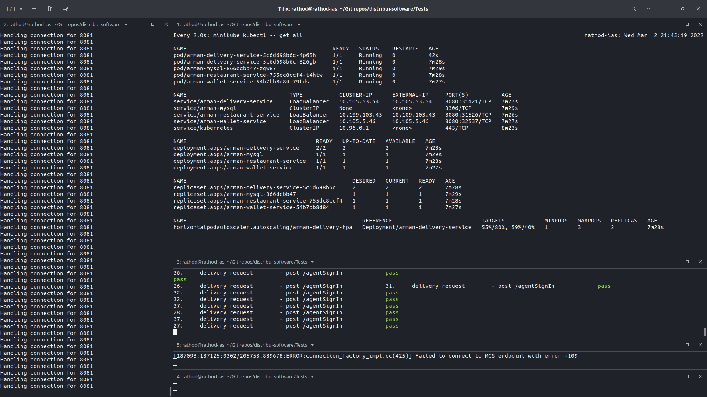
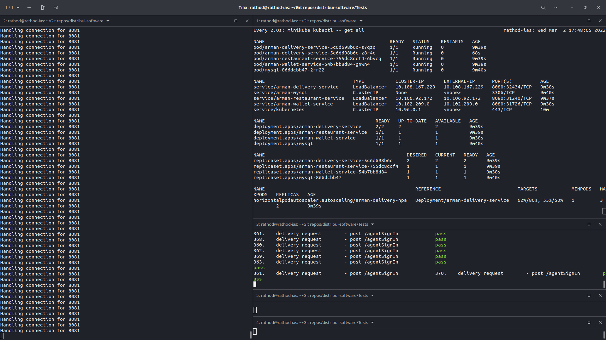
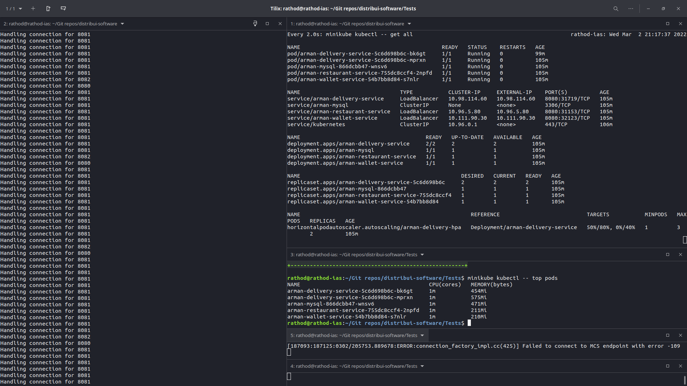

# distribui-software

## Principles of Distributed Software

### commands

    for setup and start the application 
    (Note: initialData.txt is required to be present in the Downloads directory):

        ./launch.sh

        Note: make sure 'minikube tunnel' is running (do it manually)

    for stop the application and clean the application

        ./teardown.sh

    Incase, the launch fails due to port allocation/deallocation

        make port-forwards

    for testcases, goto "Tests folder", and run the following commands

        ./runtest.sh

### Testcase implementation

    Used "requests" library of python

### Troubleshooting

    If you are facing issue with port allocation/deallocation, run the following commands for few times

        ps aux | grep port-forward | awk '{print $2}' | xargs kill
        make port-forwards

    Make sure that metric-server is running.

    Note: To view the autoscaling feature, we need to wait for considerable amount of time(maybe 10 to 15 mins)
     in addition to generating huge amount of concurrent requests.

### Screenshots

    
    
    
    